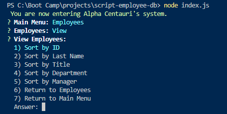
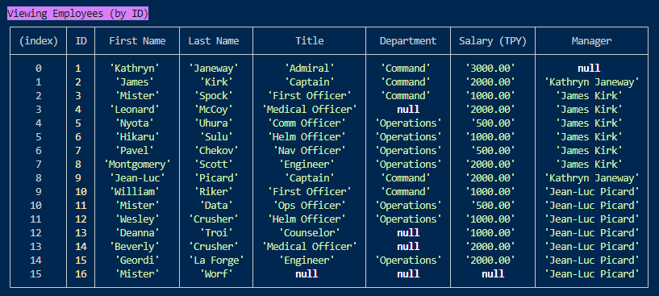
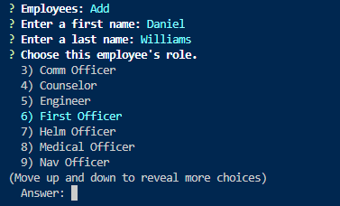

  # Employee Tracker 

  ## Description

  The function of this application is to allow users to interact with information in a database.

  The technologies used in the development or operation of this application include Node, Chalk, and Mysql2.
  
  Although I started early, I should have finished it early, because I would have discovered how big this assignment actually is, and all of the issues that I ran up against. So, I greatly underestimated this project, and there were issues that I could not solve, so I had to abandon one approach and try another multiple times throughout this project. This was tough.
    
  Future development of this application will introduce separate files for each area versus having all of the functions in one file. Also, in addition to a cleaner file, adding ASCII art, and the ability to change employee/role/department name.

  ## Mock

  

  

  
  
  

  ## Video

  https://drive.google.com/file/d/1R-QzWVkkiS7uTdBZznK8-Vsiv9uLhuyZ/view?usp=sharing
  
  ## Links

  Repo: https://github.com/Coridane/script-employee-db  